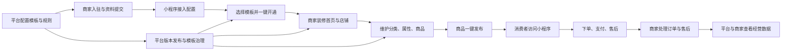
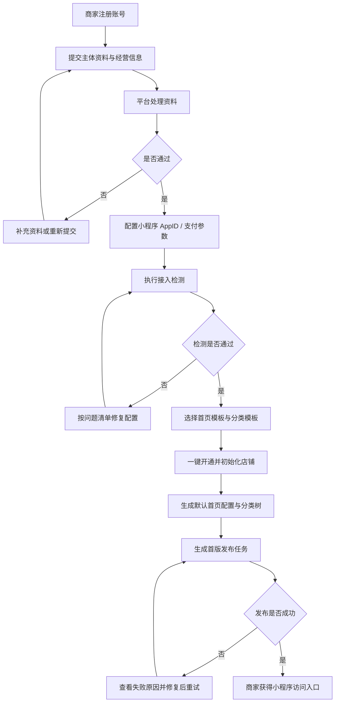
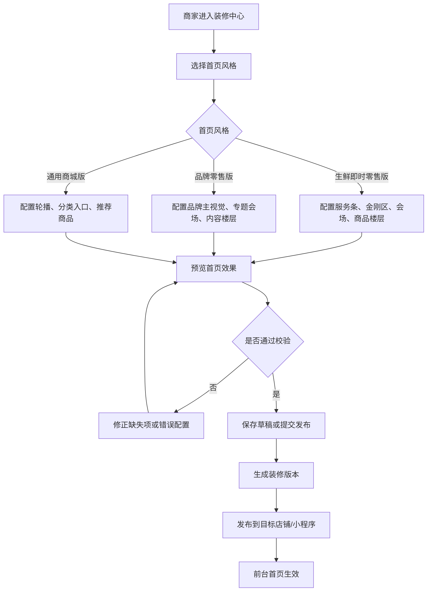
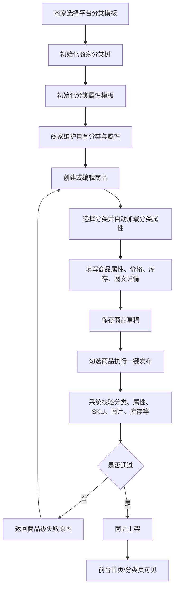
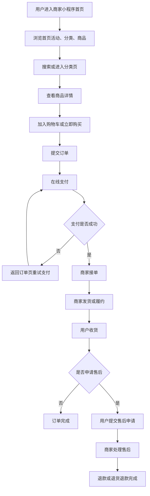
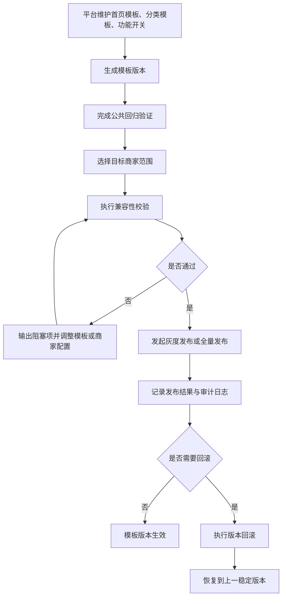
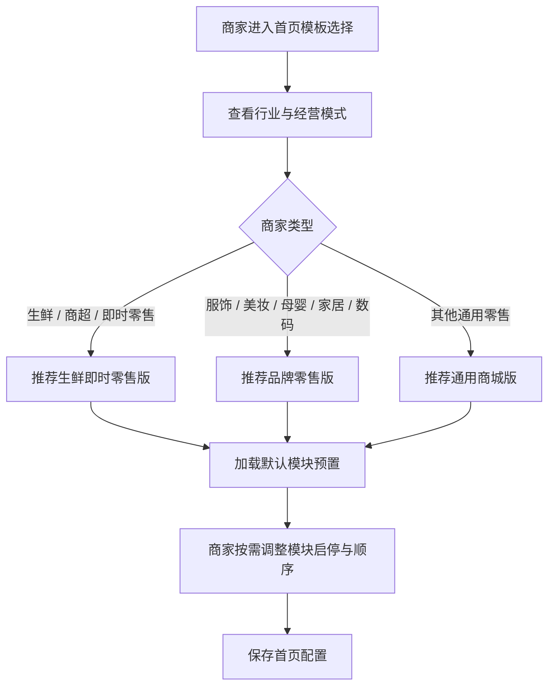
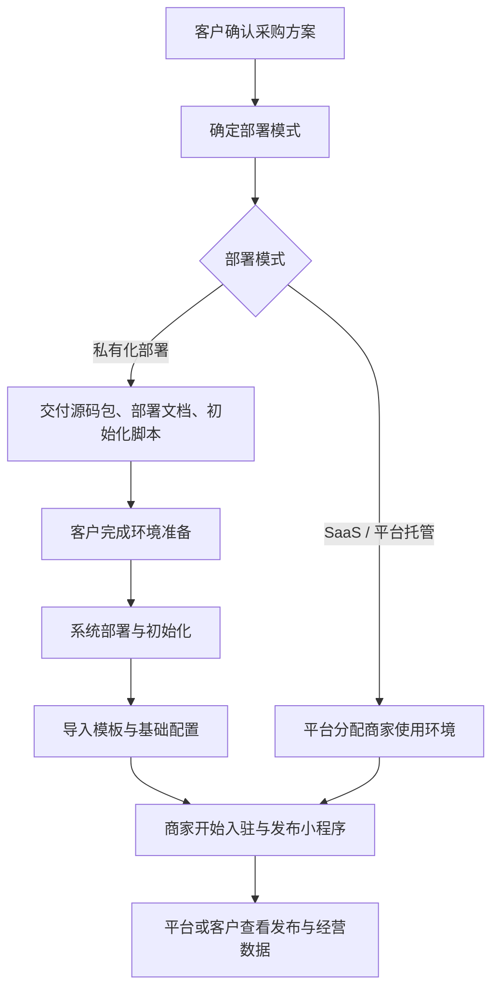

# 程哒哒业务流程图

## 1. 文档说明

- 文档用途：基于当前 PRD 输出业务侧主流程图，供产品、研发、设计、实施统一理解业务链路。
- 当前范围：聚焦多商家小程序平台的核心业务，不展开底层技术实现细节。
- 建议用途：需求评审、原型设计、技术方案拆解、排期讨论。

## 2. 平台整体业务总览

## 3. 商家入驻与开通流程

## 4. 商家首页装修与发布流程

## 5. 商品分类、属性与商品发布流程

## 6. 消费者交易流程

## 7. 平台模板治理与版本发布流程

## 8. 首页模板选择流程

## 9. 私有化交付业务流程

## 10. 建议后续补充

- 页面级流程图：首页装修流程、商品编辑流程、发布失败修复流程。
- 角色泳道图：平台、商家、消费者三方泳道。
- 状态机图：商家入驻状态、发布任务状态、商品状态、订单状态。
- 技术时序图：开通发布链路、首页数据加载链路、模板发布链路。
