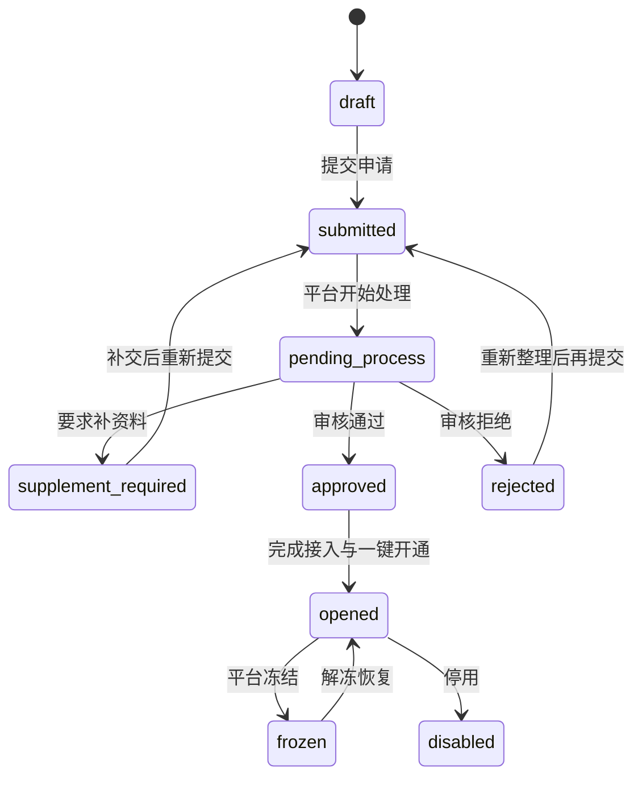
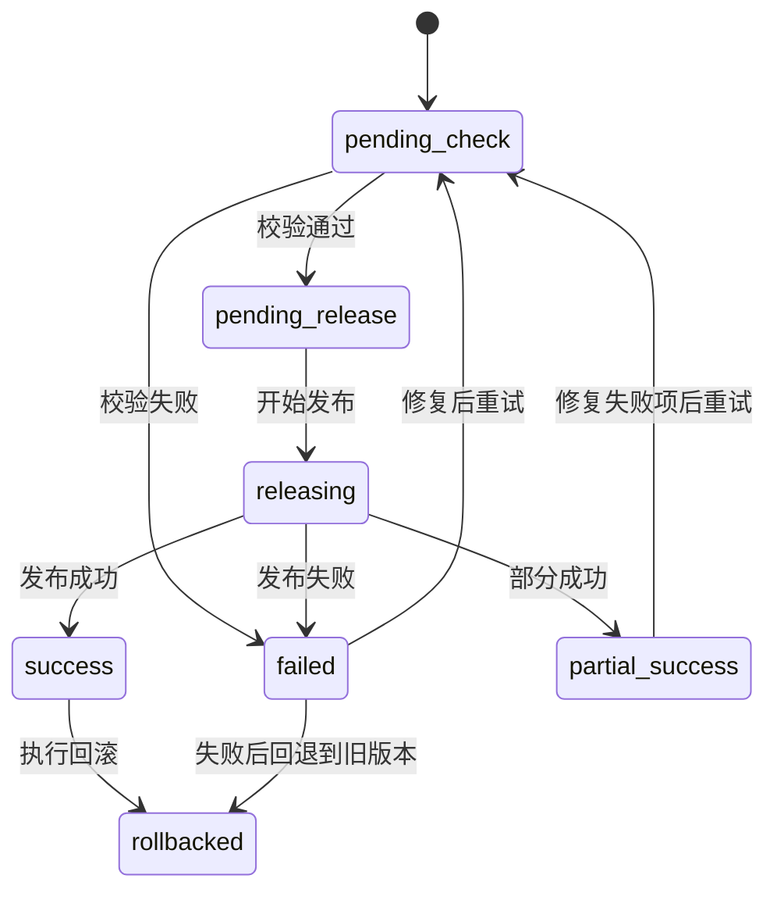
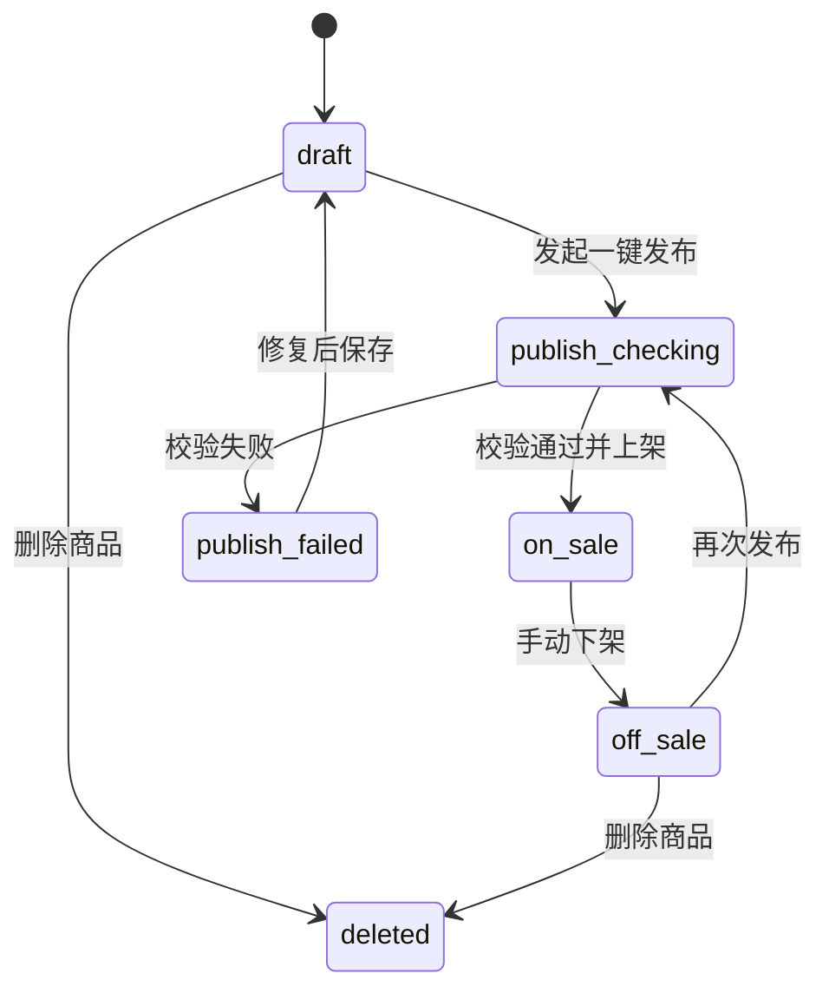
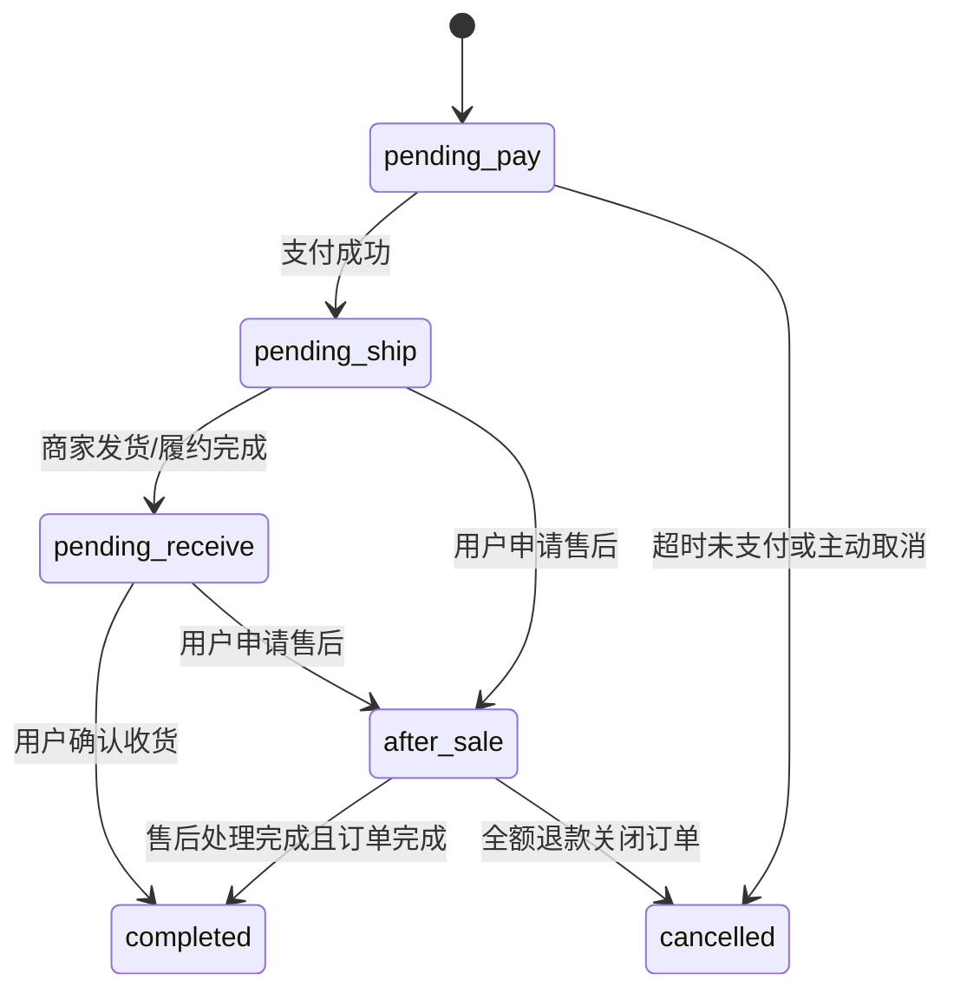
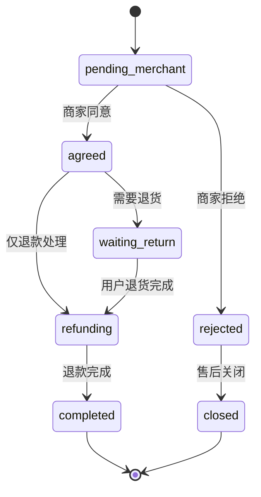
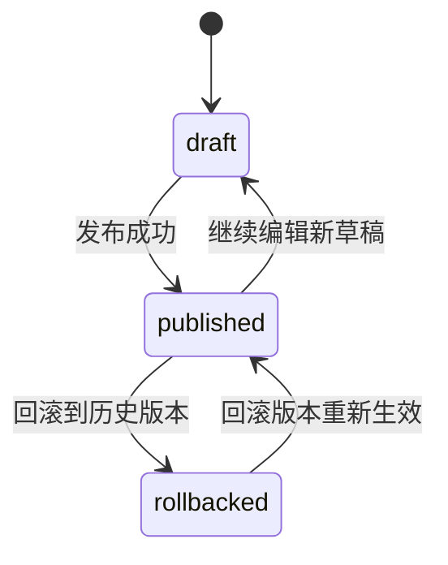
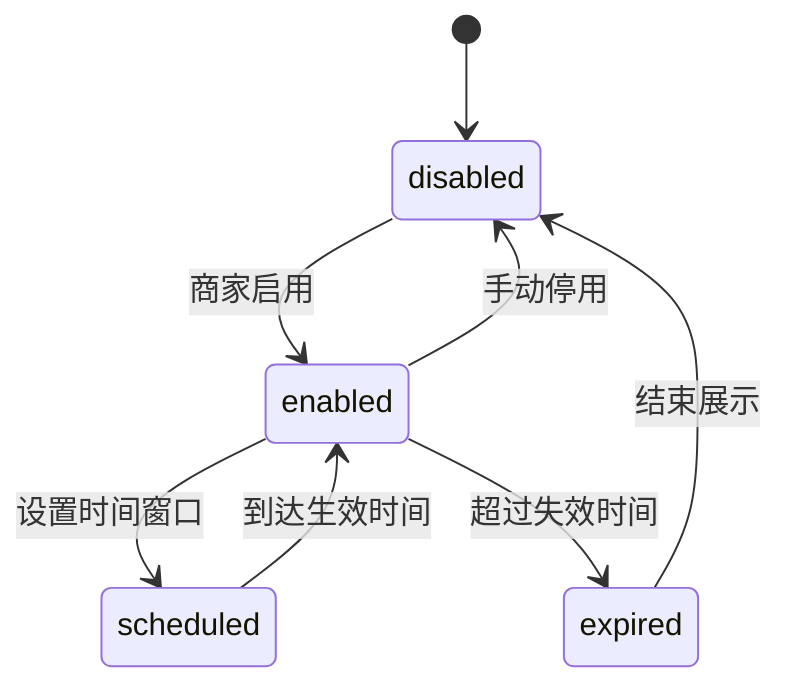

# 程哒哒状态机图

## 1. 文档说明

- 文档用途：描述核心业务对象的状态流转规则，便于产品、研发、测试统一理解系统行为。
- 当前范围：商家入驻、发布任务、商品、订单四类核心对象。
- 使用建议：与业务流程图、角色泳道图配合阅读。

## 2. 商家入驻申请状态机

## 3. 小程序/店铺发布任务状态机

## 4. 商品状态机

## 5. 订单状态机

## 6. 售后单状态机

## 7. 首页装修配置状态机

## 8. 首页模块状态机

## 9. 建议后续补充

- 分类与分类属性状态机。
- 子账号状态机与权限变更状态机。
- 模板版本状态机与模板发布状态机。
- 私有化部署任务状态机。
