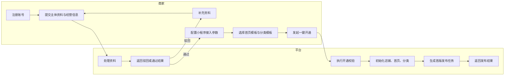
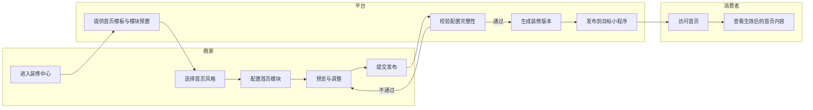
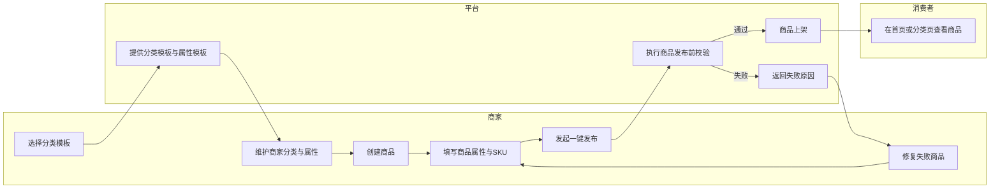
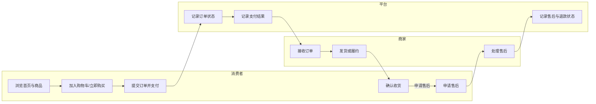
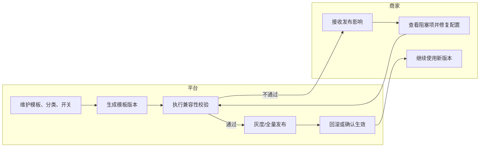
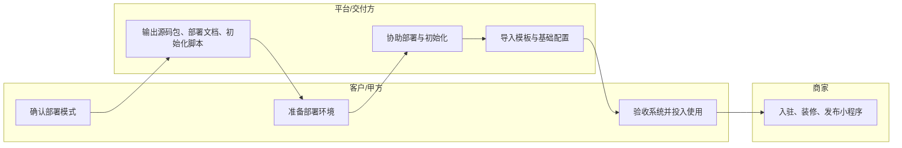

# 程哒哒角色泳道图

## 1. 文档说明

- 文档用途：从角色视角梳理平台、商家、消费者之间的职责边界与协作流程。
- 适用场景：需求评审、职责划分、接口归属判断、页面权限讨论。
- 当前范围：基于现有 PRD 输出业务侧泳道图，不涉及技术调用时序。

## 2. 商家入驻与开通泳道图

## 3. 首页装修与发布泳道图

## 4. 商品分类、属性与商品上架泳道图

## 5. 消费者交易与售后泳道图

## 6. 模板治理与版本发布泳道图

## 7. 私有化交付泳道图

## 8. 建议后续补充

- 账号与权限泳道图：平台管理员、商家主账号、商家子账号三层角色。
- 首页模板治理泳道图：平台模板维护、商家选择模板、首页发布生效。
- 多门店场景泳道图：门店切换、门店数据加载、不同门店首页差异。
- 私有化升级泳道图：版本升级、灰度验证、回滚处理。
