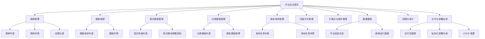
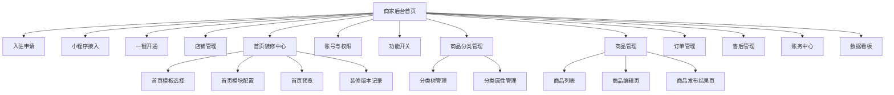
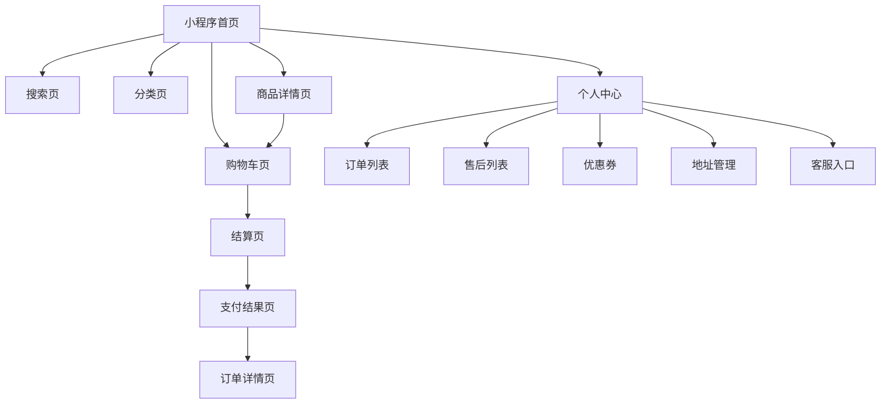
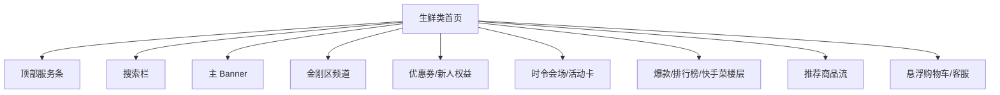
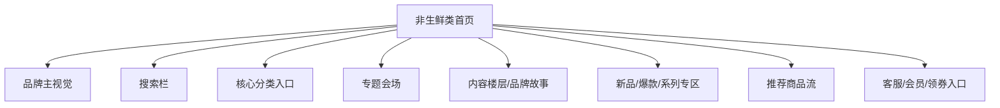

# 程哒哒页面地图

## 1. 文档说明

- 文档用途：梳理平台端、商家端、消费者端的页面结构和主要入口关系。
- 使用场景：原型设计、菜单规划、路由设计、权限设计、前端排期。
- 当前范围：聚焦一期核心页面，不展开次级弹窗和极细颗粒度交互。

## 2. 平台端页面地图

## 3. 商家端页面地图

## 4. 消费者端页面地图

## 5. 生鲜类首页页面结构

## 6. 非生鲜类首页页面结构

## 7. 页面与权限关系建议

- 平台端页面按平台管理员、交付管理员区分权限。
- 商家端页面按主账号、子账号区分菜单和动作权限。
- 首页装修、商品发布、导出等页面建议做独立动作权限控制。
- 消费者端页面按是否登录、是否有地址、是否在配送范围内展示不同内容。

## 8. 建议后续补充

- 页面级原型结构说明。
- 菜单权限矩阵。
- 页面路由设计。
- 页面与接口映射表。
