# 程哒哒技术架构图

## 1. 文档说明

- 文档用途：基于当前 PRD 和业务流程，输出第一版技术架构图，用于技术选型、系统拆分和研发评审。
- 当前阶段：技术方案草图，强调系统边界和职责，不等同于最终详细设计。
- 适用对象：产品、研发、测试、运维、交付实施。

## 2. 总体技术架构

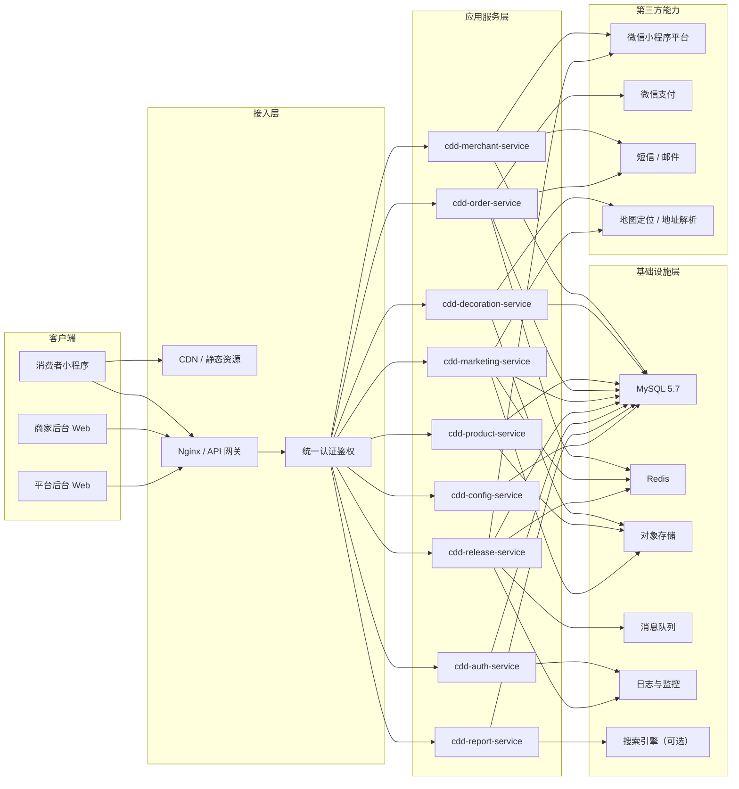

## 3. 多端系统边界

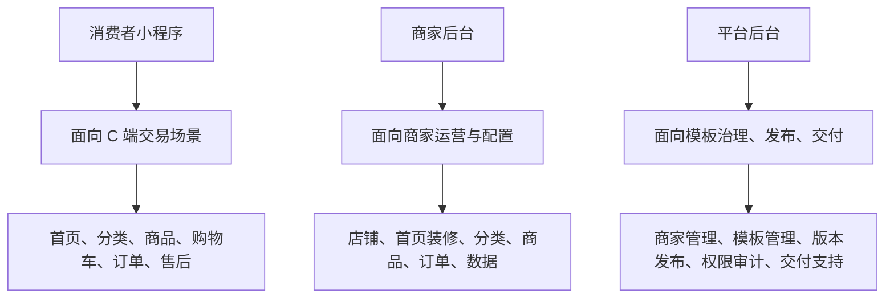

## 4. 核心服务拆分

### 4.1 商家接入服务

- 服务名：`cdd-merchant-service`
- 负责商家注册、入驻申请、资料处理状态、小程序接入检测。
- 对接微信小程序平台、短信通知等第三方能力。

### 4.2 店铺与装修服务

- 服务名：`cdd-decoration-service`
- 负责店铺信息、首页模板选择、首页模块配置、装修版本管理。
- 负责生鲜类首页和非生鲜类首页的差异化配置承接。

### 4.3 分类与商品服务

- 服务名：`cdd-product-service`
- 负责平台分类模板、分类属性模板、商家分类树、商家分类属性、商品与 SKU 数据。
- 负责库存、库存锁定、库存回补、商品发布前的商品完整性校验、分类校验和商品上架状态管理。

### 4.4 订单与售后服务

- 服务名：`cdd-order-service`
- 负责购物车、结算、订单、支付结果处理、履约状态、售后状态。
- 对接支付与退款链路。

### 4.5 营销与首页模块服务

- 服务名：`cdd-marketing-service`
- 负责首页模块数据装配、优惠券入口、活动会场、排行榜、推荐流。
- 负责按用户分层、门店、活动状态返回首页模块内容。

### 4.6 模板与发布服务

- 服务名：`cdd-release-service`
- 负责首页模板、模板版本、发布任务、灰度发布、回滚和发布日志。
- 负责商家首版开通发布和平台统一版本下发的流程编排，不直接持有分类领域数据。

### 4.7 账号权限与审计服务

- 服务名：`cdd-auth-service`
- 负责平台账号、商家主账号、商家子账号、角色权限、数据范围控制。
- 负责关键操作审计日志记录。

### 4.8 数据看板与报表服务

- 服务名：`cdd-report-service`
- 负责经营数据聚合、首页模块埋点统计、商品与订单报表。
- 支持商家视角和平台视角的数据看板。

### 4.9 配置中心 / 功能开关服务

- 服务名：`cdd-config-service`
- 负责模板默认值、功能开关、首页模块预置规则、多环境配置。
- 支持按平台、商家、店铺、小程序粒度下发配置。
- 当前基线先采用各可启动模块本地配置文件组：`application.yaml`、`application-local.yaml`、`application-dev.yaml`、`application-test.yaml`、`application-prod.yaml`。
- 后续接入 Nacos 时，统一按环境隔离 `namespace`，默认使用 `group=CHENGDD`，服务配置 `dataId` 采用 `{service-name}-{env}.yaml`，共享配置 `dataId` 采用 `cdd-common-{env}.yaml`。
- 运行时配置键统一保留为 `cdd.runtime.env`、`cdd.runtime.config-mode`，避免接入配置中心后二次改名。
- `cdd-db-migration` 不纳入 Nacos 配置链路，继续使用仓库级配置文件 `config/db-migration/application-db-migration.yml`。
- 详细约定见《[Nacos配置命名与加载约定.md](./Nacos配置命名与加载约定.md)》。

### 4.10 Maven 多模块结构建议

逻辑模块结构：

```text
cdd-parent
├─ cdd-common-core
├─ cdd-common-db
├─ cdd-common-redis
├─ cdd-common-security
├─ cdd-common-web
├─ cdd-db-migration
├─ cdd-api-auth
├─ cdd-api-merchant
├─ cdd-api-decoration
├─ cdd-api-product
├─ cdd-api-order
├─ cdd-api-marketing
├─ cdd-api-release
├─ cdd-api-report
├─ cdd-api-config
├─ cdd-api-pay
├─ cdd-pay-core
├─ cdd-gateway
├─ cdd-auth-service
├─ cdd-merchant-service
├─ cdd-decoration-service
├─ cdd-product-service
├─ cdd-order-service
├─ cdd-marketing-service
├─ cdd-release-service
├─ cdd-report-service
└─ cdd-config-service
```

- `cdd-parent` 作为父工程，统一依赖版本、插件版本、打包规则。
- `cdd-common-*` 放公共基础能力，不放具体业务表的 `Mapper` 和业务 SQL。
- `cdd-db-migration` 作为数据库迁移执行模块，负责加载独立配置并执行 `db/migration` 下的 Flyway 脚本。
- `cdd-api-*` 放 Feign 接口、DTO、VO、枚举和服务间协议对象。
- `cdd-api-pay` 放支付协议对象，不放支付渠道实现。
- `cdd-pay-core` 放支付抽象能力和微信支付适配实现，内部可按 `wechat` 子包隔离。
- `cdd-*-service` 放各服务自己的 controller、application、domain、infrastructure 实现。
- `cdd-gateway` 单独作为统一接入层，对外暴露 API。

当前物理目录结构：

```text
repo/
├─ cdd-parent/
│  ├─ pom.xml
│  ├─ cdd-common-*
│  ├─ cdd-api-*
│  ├─ cdd-db-migration
│  ├─ cdd-pay-core
│  ├─ cdd-gateway
│  └─ cdd-*-service
├─ config/
│  └─ db-migration/
├─ db/
│  └─ migration/
├─ docs/
└─ scripts/
```

## 5. 服务调用关系

### 5.1 总体调用原则

- 外部请求统一先进入 `cdd-gateway`。
- 鉴权、账号、权限校验统一由 `cdd-auth-service` 提供能力。
- 业务服务之间优先通过 `cdd-api-*` 暴露的接口调用，不允许跨服务直接访问数据库。
- `cdd-release-service` 负责发布编排，不负责分类、商品、首页配置等领域数据持久化。
- 高实时、强阻塞链路采用同步调用；报表、埋点、发布结果通知等采用异步事件或任务方式。
- `cdd-report-service` 优先消费事件或读取汇总数据，不应成为核心交易链路上的同步阻塞点。

### 5.2 服务调用总览

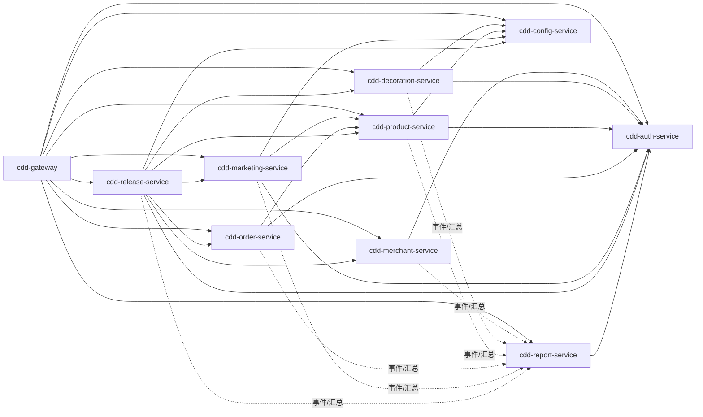

### 5.3 主链路调用关系

#### 5.3.1 商家入驻与开通

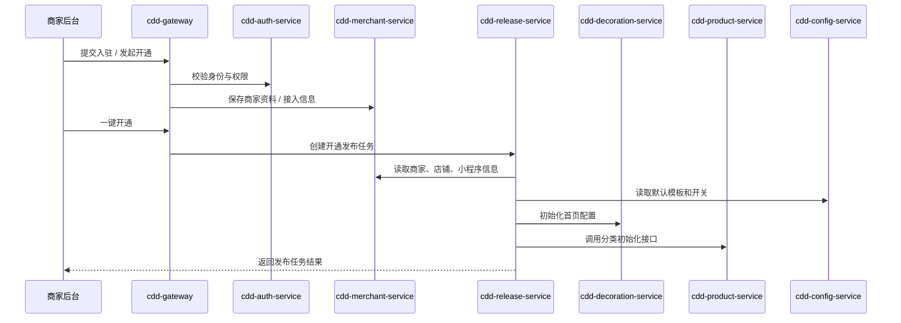

#### 5.3.2 首页加载

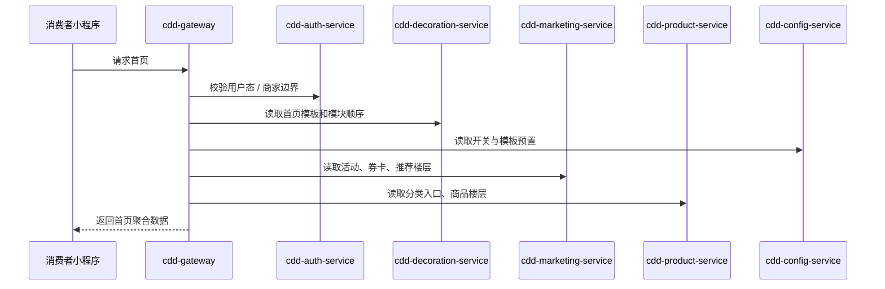

#### 5.3.3 商品发布

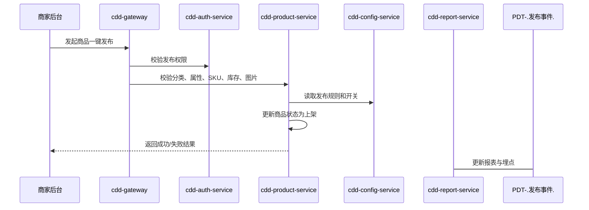

#### 5.3.4 下单与售后

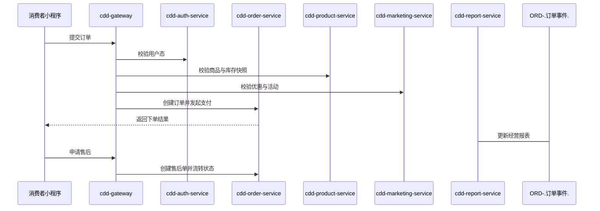

### 5.4 同步与异步边界建议

| 场景 | 建议方式 | 说明 |
| --- | --- | --- |
| 登录鉴权、权限校验 | 同步 | 必须实时返回 |
| 首页配置读取 | 同步 | 属于前台强依赖链路 |
| 商品发布校验 | 同步 | 需要立即返回失败原因 |
| 首页埋点、报表统计 | 异步 | 不应阻塞主流程 |
| 发布任务执行 | 异步 | 适合任务化执行 |
| 订单完成后的统计汇总 | 异步 | 避免影响交易主链路 |

### 5.5 `cdd-product-service` 与 `cdd-release-service` 边界说明

- `cdd-product-service` 持有分类模板、分类属性模板、商家分类、商家分类属性、商品、SKU 等数据与规则。
- `cdd-release-service` 持有模板版本、发布任务、灰度记录、回滚记录、发布日志等发布域数据。
- 商家开通时，`cdd-release-service` 可以调用 `cdd-product-service` 初始化分类，但不直接写分类表。
- 商品发布前的商品完整性校验和分类校验由 `cdd-product-service` 负责；发布服务只负责平台模板版本发布和开通发布任务编排。

### 5.6 购物车与库存归属说明

- 购物车归 `cdd-order-service`，因为购物车属于交易前置链路，与结算、下单、优惠试算、失效处理关系最紧。
- 库存归 `cdd-product-service`，因为库存属于商品域核心数据，与商品、SKU、可售状态、上架状态强绑定。
- `cdd-order-service` 不直接持有库存主数据，应通过接口调用 `cdd-product-service` 完成库存校验、锁定、扣减和回补。
- 购物车查询时，`cdd-order-service` 可持有购物车主数据，商品展示信息由 `cdd-product-service` 提供，优惠试算由 `cdd-marketing-service` 提供。
- 下单时由 `cdd-order-service` 发起交易流程，`cdd-product-service` 负责库存校验与库存处理。
- 订单取消、超时未支付、售后退款等触发库存回补时，应由 `cdd-order-service` 发起回补请求，实际库存处理由 `cdd-product-service` 完成。

### 5.7 支付归属与 Maven 逻辑隔离说明

- 支付业务归 `cdd-order-service`，包括支付发起、支付结果处理、退款发起、退款结果更新和订单支付状态流转。
- 微信支付对接逻辑不直接散落在 `cdd-order-service` 业务代码中，应在 Maven 结构上做逻辑隔离。
- `cdd-api-pay` 仅放支付请求对象、响应对象、枚举和协议定义，不放微信支付实现代码。
- `cdd-pay-core` 放支付抽象接口、支付客户端、回调处理抽象，并在内部通过 `wechat` 子包隔离微信支付实现。
- 当前阶段不单独拆 `cdd-pay-wechat` 模块，以降低模块复杂度；若后续接入多支付渠道，可再从 `cdd-pay-core` 中独立拆出支付渠道模块。

## 6. 首页数据加载架构

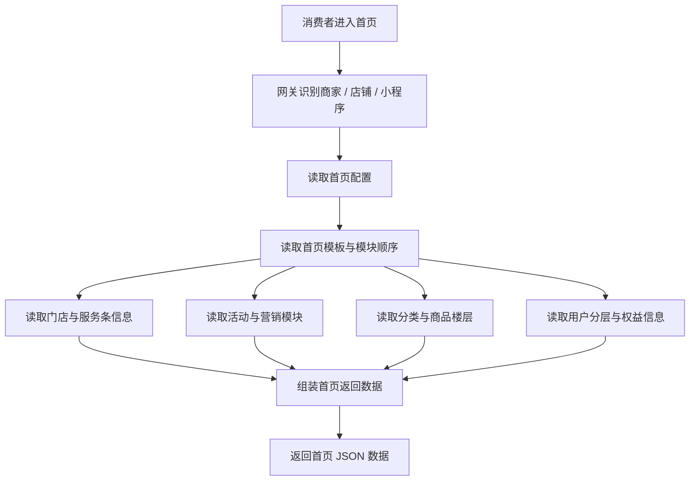

## 7. 模板发布架构

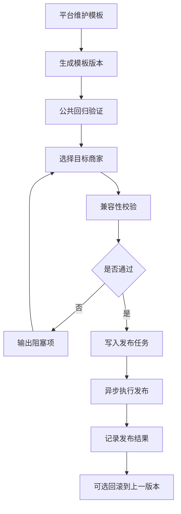

## 8. 多租户与数据隔离架构

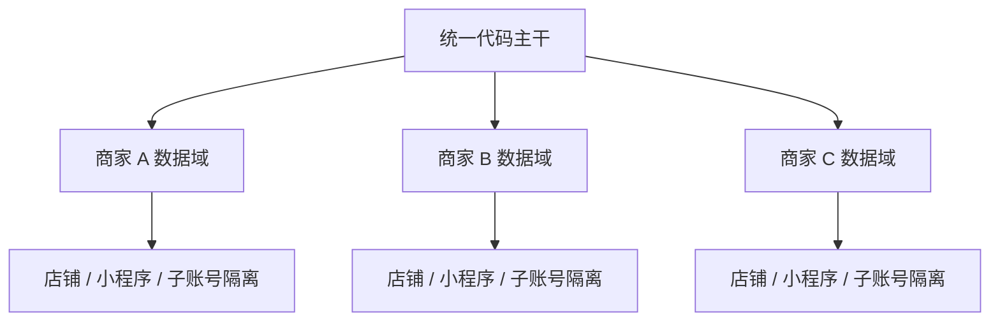

- 所有核心业务表必须具备商家边界。
- 商家内部再按店铺、小程序、子账号权限控制可见范围。
- 查询、导出、缓存、日志都必须遵循同样的租户隔离规则。

## 9. 私有化部署架构

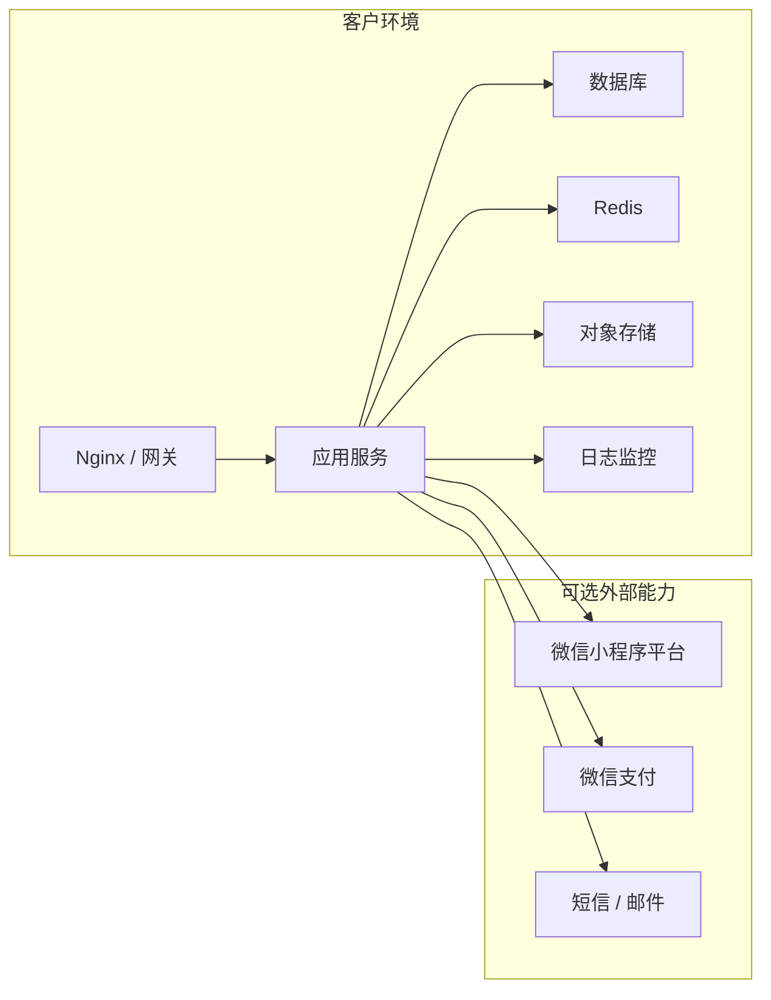

- 轻量版可采用单应用实例 + 托管数据库/Redis/对象存储。
- 标准版可拆分应用服务与发布服务。
- 高可用版可进一步做多实例、负载均衡、主从或集群。

## 10. 技术选型建议输入

### 9.1 后端

- 优先考虑 `Java Spring Boot` 或 `Node.js NestJS`。
- 若团队偏企业级交付与长期维护，`Java Spring Boot` 更稳。
- 若团队追求开发效率和前后端协同，`NestJS` 也可行。

### 9.2 前端

- 商家后台、平台后台建议采用 `React`。
- 小程序端建议采用原生小程序或 `Taro/UniApp` 统一多端方案。

### 9.3 数据与缓存

- 主业务数据使用 `MySQL 5.7`。
- 高频读取、会话、配置缓存建议使用 `Redis`。
- 商品搜索、首页搜索增强场景可按需接入 `Elasticsearch`。

### 9.4 发布与部署

- 初期优先单体应用 + 模块化分层，降低小微企业部署成本。
- 发布任务、消息通知、报表任务可先做同应用异步任务，再视规模拆分。
- 若客户需要自动化交付，可附带 CI/CD 服务。

## 11. 数据库访问与公共包设计原则

### 10.1 设计原则

- 数据库访问实现归各业务服务内部，不建议抽成独立“数据库服务”。
- 公共包只放数据库基础能力，不放各业务域的具体表操作代码。
- 一期可采用单库多表模式，但逻辑上必须严格按服务边界分域。
- 后期若业务规模增长，可在保持代码边界不变的前提下平滑拆库。

### 10.2 建议统一放入公共包的内容

- 数据源与连接池配置。
- MyBatis / MyBatis Plus 公共配置。
- 分页插件与通用查询封装。
- 多租户上下文和租户拦截器。
- 审计字段基类，例如 `id`、`created_at`、`updated_at`、`created_by`、`updated_by`。
- 数据库异常统一封装。
- Redis、Redisson 的基础配置与工具封装。

建议公共模块：
- `common-core`
- `common-db`
- `common-redis`
- `common-security`

### 10.3 不建议放入公共包的内容

- 各业务表的 `Mapper / Repository`。
- 各业务域的实体对象、DO、聚合查询对象。
- 具体业务 SQL。
- 具体业务事务逻辑。
- 跨业务域直接联表的查询实现。

### 10.4 建议的数据库访问归属

- `cdd-merchant-service` 负责商家、店铺、子账号、入驻申请相关表。
- `cdd-decoration-service` 负责首页模板选择、首页配置、装修版本、首页模块配置相关表。
- `cdd-product-service` 负责分类模板、商家分类、分类属性、商品、SKU 相关表。
- `cdd-order-service` 负责购物车、订单、支付结果、售后单相关表。
- `cdd-release-service` 负责模板版本、发布任务、发布日志、灰度与回滚记录相关表。
- `cdd-report-service` 负责报表结果表、统计快照表、埋点汇总表。

### 10.5 一期推荐落地方式

- 数据库物理上先采用一套 `MySQL`。
- 各服务逻辑上只访问自己负责的数据表。
- 所有核心业务表统一带租户边界字段，例如 `merchant_id`、`store_id`、`mini_program_id`。
- 跨服务数据获取优先通过接口调用、事件同步或只读汇总表，不建议直接跨服务读写业务表。

### 10.6 不建议的实现方式

- 不建议把所有 `Mapper`、`Entity` 放到一个公共包供所有服务直接使用。
- 不建议做单独 `db-service` 让所有服务通过 RPC 查数据库。
- 不建议允许每个服务自由操作所有业务域表，否则后期无法真正独立部署或拆库。

## 12. 按服务边界拆分对后续独立服务的影响

### 11.1 对独立部署的影响

- 代码按服务边界拆分后，每个服务可以单独启动、单独打包、单独部署。
- 后期若某个业务域压力上升，可只扩容对应服务，而不必整体扩容全部应用。
- 整体部署可先采用同机多服务方式，后续再平滑迁移到独立部署，而不需要重构业务代码。

### 11.2 对数据库拆分的影响

- 代码边界清晰后，各服务只操作自己负责的表，后续更容易从单库多表演进到按服务拆库。
- 若前期未按服务边界约束数据库访问，后期拆库会出现大量跨服务改造，成本很高。
- 一期建议物理单库、逻辑分域；后期再按业务增长情况逐步拆库。
- 数据库表建议统一采用 `cdd_{domain}_{object}` 命名，例如 `cdd_product_spu`、`cdd_order_info`、`cdd_release_task`。

### 11.3 对接口设计的影响

- 服务边界清晰后，跨服务能力应通过接口调用、事件同步或只读汇总表实现。
- 各服务不能直接依赖其他服务内部实现，否则后期无法真正独立部署。
- 这会使接口边界、入参与出参更清晰，也更利于后续 OpenAPI 管理和接口版本治理。

### 11.4 对事务与一致性的影响

- 单服务内部优先使用本地事务。
- 跨服务场景应采用接口补偿、重试机制、消息驱动或最终一致性方案。
- 不建议依赖跨多个服务的大事务，否则服务拆分后会带来高耦合和高风险。

### 11.5 对测试与发布的影响

- 服务边界清晰后，可按服务进行单元测试、接口测试、联调测试和回归测试。
- 发布时可只发布变更服务，减少整站发布风险。
- 出现故障时也更容易定位到具体服务，并支持局部回滚。

### 11.6 对私有化交付的影响

- 对小微客户可先采用轻量整体部署，降低首期交付成本。
- 对标准客户或后续增长场景，可逐步切换为独立服务部署。
- 因代码边界已提前拆清，部署模式切换主要调整部署拓扑和配置，不需要重写业务代码。

### 11.7 对研发协作的影响

- 前期模块设计要求更高，服务边界、公共包边界、表归属需要先约束清楚。
- 短期开发速度可能略慢，但长期维护、扩展、排障和交付效率会更高。
- 若边界拆分清楚，前后端、测试、实施人员都更容易围绕服务责任划分工作。

### 11.8 推荐结论

- 当前项目应采用“逻辑按服务边界拆分，部署先轻量聚合，后续支持独立拆分”的路线。
- 这样既能满足低成本上线，又能为后续独立部署、拆库扩容、局部发布和私有化升级保留清晰路径。

## 13. 建议后续补充

- 服务级技术设计文档。
- 数据库表结构设计。
- 接口调用时序图。
- 首页模块装配设计。
- 发布任务执行与回滚设计。
