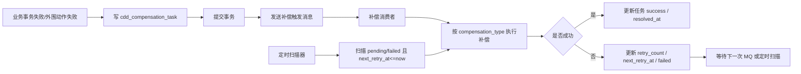

# 程哒哒补偿任务执行器与 MQ 协同设计

## 1. 文档说明

- 本文用于说明 `cdd_compensation_task` 如何真正被执行。
- 设计目标不是在“数据库扫描”和“MQ 驱动”之间二选一，而是明确两者如何协同。
- 推荐方案：`数据库持久化事实源 + MQ 触发执行 + 定时扫描兜底`。

## 2. 为什么不能只靠 MQ

只用 MQ 的问题：

- 消息可能丢失，补偿任务会沉没。
- 消费者可能处理一半失败，消息被重复投递时难以追踪“到底做到哪一步”。
- 超过重试次数后，很难形成可人工接管的任务清单。
- 很难做统一的后台查询、告警和人工重放。

只用数据库扫描的问题：

- 延迟通常较高，无法及时触发刚创建的补偿任务。
- 高频链路下，全表或大范围扫描成本会越来越高。
- 没有实时触发机制，任务恢复速度依赖扫描周期。

所以建议：

- `cdd_compensation_task` 负责“任务真实存在”
- MQ 负责“尽快叫醒执行器”
- 定时扫描负责“兜底补漏”

## 3. 推荐架构



## 4. 组件划分

### 4.1 补偿任务生产者

职责：

- 在主事务或事务提交后创建 `cdd_compensation_task`
- 生成最小重放上下文 `payload_json`
- 尝试发送一条 MQ 消息

触发场景：

- 支付回调已入账，但订单状态更新失败
- 退款成功，但售后单未同步完成
- 发布成功，但 `current_template_version` 未回写
- 一键开通时分类或装修初始化部分失败

### 4.2 补偿消息主题

建议主题名：

- `cdd.compensation.trigger`

建议消息体字段：

- `task_code`
- `biz_type`
- `biz_id`
- `compensation_type`
- `created_at`

说明：

- MQ 消息只负责触发，不承载完整补偿上下文。
- 真正执行所需的上下文以数据库中的 `payload_json` 为准。

### 4.3 补偿消费者

职责：

- 消费 MQ 消息
- 根据 `task_code` 读取 `cdd_compensation_task`
- 抢占执行权
- 调用对应补偿处理器
- 更新任务状态

### 4.4 定时扫描器

职责：

- 周期性扫描 `task_status in ('pending', 'failed')`
- 且 `next_retry_at <= now()`
- 对未被 MQ 及时触发或消费失败的任务进行兜底执行

## 5. 任务状态机

建议状态：

- `pending`
- `running`
- `success`
- `failed`
- `dead`
- `cancelled`

状态语义：

| 状态 | 含义 |
| --- | --- |
| `pending` | 已创建，等待执行 |
| `running` | 某个执行器已抢到任务，正在补偿 |
| `success` | 补偿完成 |
| `failed` | 本次执行失败，但还可继续重试 |
| `dead` | 已超过最大重试次数，等待人工处理 |
| `cancelled` | 业务确认无需再补偿 |

建议状态流转：

```text
pending -> running -> success
pending -> running -> failed -> pending
pending -> running -> failed -> dead
pending -> cancelled
```

补充规则：

- `failed` 更适合表达“刚失败完的一次执行结果”
- 若希望统一扫描简单，可在失败后直接回写 `pending` 并设置 `next_retry_at`
- 若保留 `failed`，扫描器应同时扫描 `pending` 和 `failed`

## 6. 抢占与并发控制

### 6.1 为什么必须抢占

原因：

- 可能有多个消费者实例同时收到同一条 MQ 消息
- 定时扫描器与 MQ 消费者可能同时命中同一任务
- 同一个任务如果被并发执行，会导致补偿动作重复落地

### 6.2 推荐抢占方式

基于数据库乐观更新：

```sql
UPDATE cdd_compensation_task
SET
  task_status = 'running',
  updated_by = ?,
  version = version + 1
WHERE task_code = ?
  AND deleted = 0
  AND task_status IN ('pending', 'failed')
  AND next_retry_at <= NOW()
  AND version = ?;
```

执行规则：

- 更新行数为 `1` 才表示抢占成功
- 更新行数为 `0` 说明已被其他实例抢走，当前执行器直接退出

## 7. 重试与退避策略

### 7.1 建议默认策略

默认重试次数：

- `max_retry_count = 10`

默认退避策略：

- 第 1 次失败：1 分钟后
- 第 2 次失败：5 分钟后
- 第 3 次失败：15 分钟后
- 第 4 次失败：30 分钟后
- 第 5 次及之后：60 分钟后

### 7.2 按错误类型区分

| 错误类型 | 处理建议 |
| --- | --- |
| 网络超时 | 可快速重试 |
| 第三方限流 | 按较长退避时间重试 |
| 数据不存在 | 直接转 `dead` 或人工确认 |
| 状态不匹配 | 先做幂等核查，再决定忽略或转人工 |
| 参数缺失 | 不应自动重试，转 `dead` |

### 7.3 状态更新规则

成功时：

```sql
UPDATE cdd_compensation_task
SET
  task_status = 'success',
  resolved_at = NOW(),
  updated_by = ?,
  version = version + 1
WHERE id = ?
  AND deleted = 0
  AND task_status = 'running'
  AND version = ?;
```

失败时：

```sql
UPDATE cdd_compensation_task
SET
  task_status = CASE WHEN retry_count + 1 >= max_retry_count THEN 'dead' ELSE 'failed' END,
  retry_count = retry_count + 1,
  next_retry_at = ?,
  last_error_code = ?,
  last_error_message = ?,
  updated_by = ?,
  version = version + 1
WHERE id = ?
  AND deleted = 0
  AND task_status = 'running'
  AND version = ?;
```

## 8. MQ 与数据库的协同细节

### 8.1 推荐执行顺序

1. 在本地事务内创建 `cdd_compensation_task`
2. 提交事务
3. 事务提交后发送 MQ 消息
4. 消费者按 `task_code` 读取任务并执行

原因：

- 如果先发 MQ 再落库，消费者可能先收到消息但查不到任务
- 如果落库成功但 MQ 发送失败，仍可由定时扫描兜底

### 8.2 MQ 消息丢失怎么办

答案：

- 不依赖 MQ 作为唯一触发源
- 依靠定时扫描器发现 `pending/failed` 的任务并继续执行

### 8.3 MQ 重复投递怎么办

答案：

- 消费者永远先查 `cdd_compensation_task`
- 只有抢占成功的实例才会执行
- 抢占失败的消费者直接 ack 并退出

## 9. 补偿处理器设计

### 9.1 建议的处理器接口

```java
public interface CompensationHandler {
    String compensationType();
    CompensationResult handle(CompensationTask task);
}
```

### 9.2 建议拆分的处理器

| compensation_type | 处理器职责 |
| --- | --- |
| `pay_order_status_sync` | 支付成功后补写订单状态 |
| `refund_after_sale_sync` | 退款成功后补写售后/订单退款状态 |
| `release_version_sync` | 发布成功后补写小程序当前模板版本 |
| `merchant_onboarding_init` | 一键开通失败后的初始化补偿 |

### 9.3 处理器内部要求

- 先做业务幂等校验，再决定是否真正补偿
- 若业务目标状态已经达成，应直接返回成功
- 不允许在处理器内部再无上限地递归创建新补偿任务

## 10. 扫描器设计建议

### 10.1 扫描频率

建议：

- 常规扫描频率：30 秒到 60 秒一次
- 若任务量上升，可改为 5 秒到 10 秒一次分片扫描

### 10.2 分批拉取

建议：

- 每次最多拉取 100 到 500 条
- 按 `next_retry_at asc, id asc` 排序
- 避免一次性扫太多导致长事务

### 10.3 分片方式

可选方案：

- 按 `id % N`
- 按 `biz_type`
- 按时间窗口

一期建议：

- 先单任务池或单分片实现
- 量上来后再按 `id % N` 做水平分片扫描

## 11. 人工介入与告警

### 11.1 何时告警

- 任务进入 `dead`
- 同一 `biz_type + compensation_type` 连续失败超过阈值
- 10 分钟内 `failed` 任务数突增

### 11.2 后台需要具备的能力

- 查看补偿任务列表
- 按 `biz_type`、`task_status`、时间范围筛选
- 查看 `payload_json`、错误码、错误信息
- 手动重试
- 手动取消

### 11.3 人工重试规则

- 人工重试本质上不是直接执行业务动作
- 更推荐把任务状态改回 `pending`，并立即投递一条 MQ 触发消息

## 12. 推荐实现结论

推荐组合：

- `cdd_compensation_task` 作为真实任务源
- MQ 作为低延迟触发器
- 定时扫描器作为兜底执行器
- 处理器按 `compensation_type` 路由

不推荐：

- 只靠 MQ，不落库
- 只扫主业务表做隐式补偿
- 用补偿逻辑直接覆盖业务主状态而不做幂等判断

## 13. 下一步建议

建议继续补两项：

1. Java 服务层伪代码，把生产者、消费者、扫描器、处理器接口串起来。
2. 运维侧告警与后台操作说明，把 `dead` 任务如何处理写成流程。
